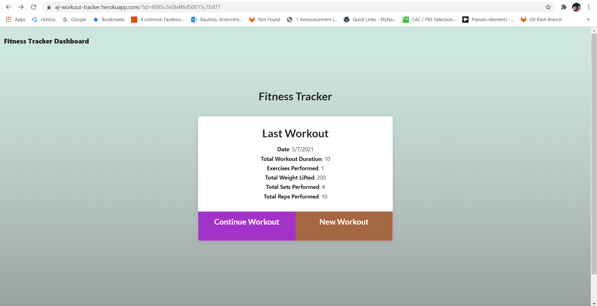
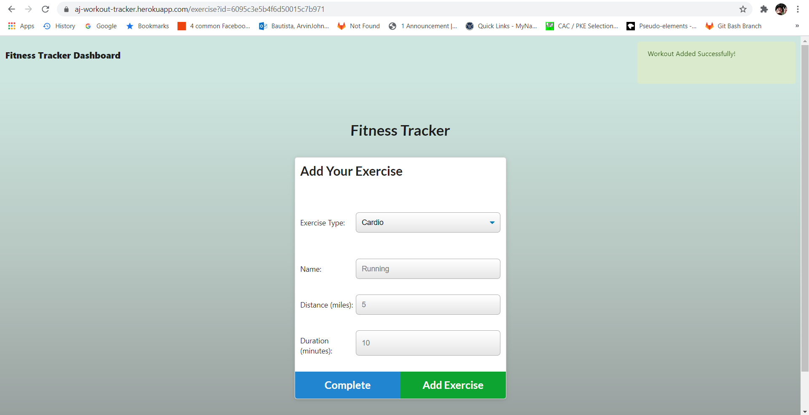
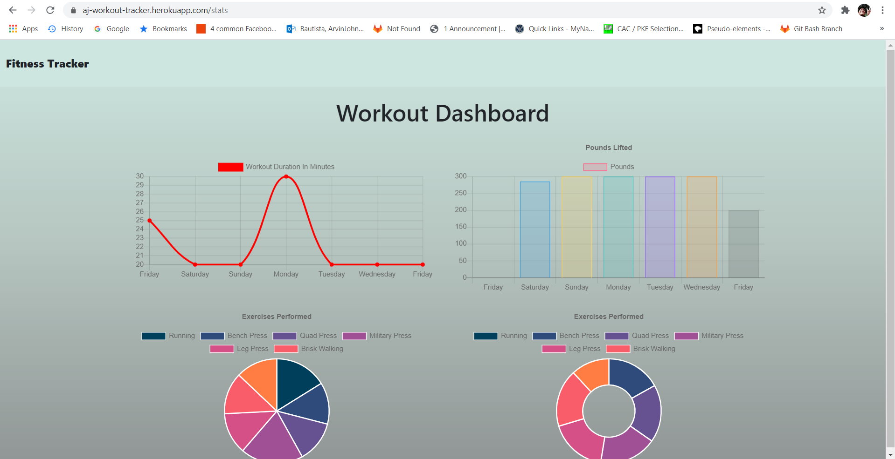

# Unit 17 NoSQL Homework: Workout Tracker

## Description

For this web app, it will serve as a workout tracker, it will be able to view, create and track daily workouts, also will be able to log multiple exercises in a workout routine on a given day. Exercises should be tracked by their durations, resistance exercise should track the exercise name, type, weight, sets and reps, while if doing cardio exercise, it should be able to track the distance travelled. All datas collected will be displayed and generated in charts form. This web app is created with Mongo database through MongoDB Cloud, schema made from Mongoose and routes handling from Express.

## Deployment

Live @ https://aj-workout-tracker.herokuapp.com/

## Screenshots

Welcome to workout tracker index.

It will require some input from the user.

This is the workout tracker dashboard, in here, charts are generated.

## Acknowledgements

- Mr. John
- Mr. Luis
- Mr. Faran, Navazi
- Javier Perez
- Oliver Shih
- William Lucht
